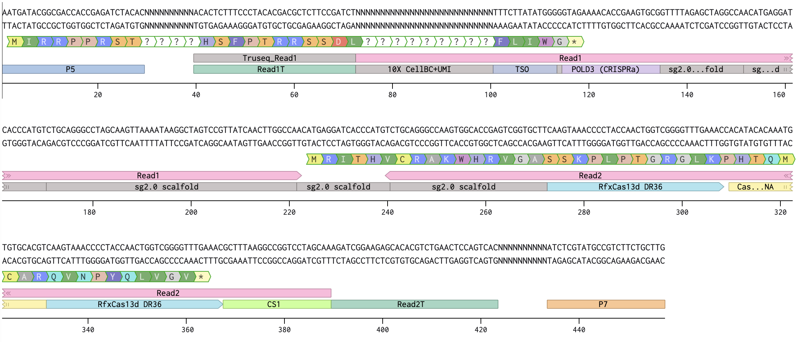

# PAIR-perturb-seq

Single-cell PAIR-perturb-seq experiment in human 293T-PAIR cells. Code here
generates the panels in **Fig 4** and **Extended Data Fig 5** of the
manuscript. See [`../docs/manuscript_outline.md`](../docs/manuscript_outline.md)
for the panel-by-panel script map.

## Experimental design

11 individual PAIR lenti lines (P21, P53, P54, P56, P57, P61–P66) were used
to infect human 293T-PAIR cells, drug-selected with puromycin, then pooled.
The pooled population was split into two groups of 3 biological replicates
each:

- **Group 1 (RNP):** Cas9/sgAAVS1 RNP transfected — DSB stimulation arm
- **Group 2 (CTRL):** Cas9/non-targeting RNP transfected — no-DSB control

Each replicate was hashtag-stained with a TotalSeq™-C HTO antibody (C0254–C0259),
pooled, and processed on a 10x Genomics 5' workflow. Three libraries
(transcriptome, hashtag, PAIR RNA) were sequenced on NovaSeq X Plus (PE150).

After QC, 2,271 cells across 1 CTRL replicate (Ctl1) + 2 RNP replicates
(RNP2, RNP3) form the analysis dataset.

- **Genome:** human (GRCh38)
- **Sequencing:** NovaSeq X Plus, PE150, one lane

## RAW data

See [`../data/README.md`](../data/README.md) for raw FASTQ accessions and
processed-data download links.

## PAIR RNA library structure



## Local setup

1. **Configure paths.** Copy `code/config.example.R` to `code/config.local.R`
   and edit `DATA_ROOT` to the absolute path of your local data directory.
   `config.local.R` is gitignored.

   ```r
   # code/config.local.R
   DATA_ROOT <- "/path/to/perturb-seq-data-root"
   ```

2. **Data layout under `DATA_ROOT`** (see `../data/README.md` for download
   links):

   ```
   DATA_ROOT/
   └── data/
       ├── objs/
       │   └── seu_qc.qs              # final QC Seurat object (input to all 0X scripts)
       ├── pathways/
       │   └── hallmark_pathways.rds  # MSigDB Hallmark gene sets
       └── reference/
           └── ensembl_to_hgnc_hsapiens.csv

   # output/ and figures/ are written by the analysis scripts under DATA_ROOT
   ```

3. **Install R packages.**
   `Rscript code/analysis_code/00_check_and_install_packages.R`

4. **Run the pipeline.** From the `perturb-seq/` directory:

   ```bash
   Rscript code/analysis_code/00_qc_filtering.R          # produces seu_qc.qs
   Rscript code/analysis_code/01_perturbation_validation.R
   Rscript code/analysis_code/02_tier1_nbn_baseline.R
   Rscript code/analysis_code/03_tier2_stress_interaction.R
   Rscript code/analysis_code/04_tier3_partner_modulation.R
   Rscript code/analysis_code/05_fgsea_analysis.R
   Rscript code/analysis_code/07_tier5_aucell.R
   Rscript code/analysis_code/08_phase2_epistasis.R
   Rscript code/analysis_code/09_cross_partner_overlap.R
   ```

## Where to read next

- [`code/README.md`](code/README.md) — script-by-script index.
- [`docs/PAIR_ASSIGNMENT_POLICY.md`](docs/PAIR_ASSIGNMENT_POLICY.md) —
  rationale for the per-cell PAIR identity assignment used in Ext Fig 5c.
- [`../docs/manuscript_outline.md`](../docs/manuscript_outline.md) —
  figure → script map.
